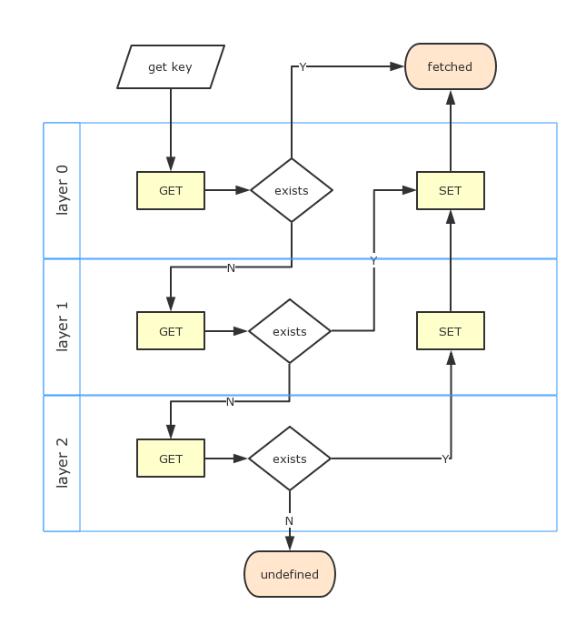

[](https://travis-ci.org/kaelzhang/node-layered-cache)
<!-- optional appveyor tst
[](https://ci.appveyor.com/project/kaelzhang/node-layered-cache)
-->
<!-- optional npm version
[](http://badge.fury.io/js/layered-cache)
-->
<!-- optional npm downloads
[](https://www.npmjs.org/package/layered-cache)
-->
<!-- optional dependency status
[](https://david-dm.org/kaelzhang/node-layered-cache)
-->

# layered-cache

The manager to handle hierarchical cache layers.

## Usage

```js
const LRU = require('lru-cache')
const LCache = require('layered-cache')
const cache = new LCache([{
  new LRU({max: 500})
}, {
  async set (key, value) {
    return save_to_db(key, value)
  },
  async get (key) {
    return get_from_db(key)
  }
}, {
  async get (key) {
    return fetch_from_remote(key)
  }
}])

cache.get('foo')  // 'bar'
```



## class LCache(layers)

- **layers** `Array<LCache.InterfaceLayer>` list of cache layers. A layer must implement the interface of `LCache.InterfaceLayer`. In the other words, a layer should have the following structures, but there is no restriction about which type the layer is. A layer could be a singleton(object), or a class instance(with properties from its prototype).

### interface `LCache.InterfaceLayer`

- **get** `function(key: any): any` method to get the cache, either synchronous or asynchronous(function that returns `Promise` or async function).
  - **key** `any` the key to retrieve the cached value could be of any type which `layered-cache` never concerns.
- **set** `function(key, value: any)` method to set the cache value, either sync or async. The method could be optional only for the last layer.
- **mget** `?function(keys): Array<any>` an optional method to get multiple data by keys
- **mset** `?function(pairs: Array<[key: any, value: any]>)` an optional method to set multiple values by keys.
- **has** `?function(key) : Boolean` an optional method to detect if a key is already in the cache, either sync or async.
- **validate** `?function(key, value) : Boolean` an optional method to validate the value and determine whether a value from a low-level cache should be saved.

### lcache.

## class LCache.Layer(layer)

The wrapper class to wrap the cache layer into an [`EventEmitter`](https://nodejs.org/dist/latest-v7.x/docs/api/events.html#events_class_eventemitter), and make sure `get`, `set`, `has` methods are all asynchronous methods, and provides:

- a `data` event after the `get` method is executed, so that the external program could known what is happening

```js
const delay = require('delay')
const store = {}
const layer = new LCache.Layer({
  get (x) {
    return delay(100).then(() => x + 1)
  },

  set (key, value) {
    store[key] = value
  },

  has (key) {
    return key in store
  }
})
.on('data', data => {
  console.log('on data', data)
})

layer.support('has')             // true
layer.has(1).then(console.log)   // prints: false

layer.get(1).then(console.log)
// prints: on data 2
// prints: 2
```

## License

MIT
